# Oracle SQL Quick Tour

## Classification of SQL

- Data Definition Language
- Data Manipulation Language
- Data Retrieval Language
- Data Control Language
- Transaction Control Language

---

`DISC` - Disconnect from database

`SHOW USER` - shows current user

---

### **Data Definition Language (DDL) Statements**

- **`CREATE`**

```bash
CREATE TABLE EMPLOYEES(
    EMP_ID NUMBER,
    FIRSTNAME VARCHAR2(50),
    LASTNAME VARCHAR2(50),
    EMAIL_ID VARCHAR(30),
    GENDER CHAR(1),
    MOBILE_NO CHAR(10),
    DATE_OF_JOINING DATE DEFAULT SYSDATE,
    DEPT_ID INT
);
```

```bash
DESC EMPLOYEES;
```

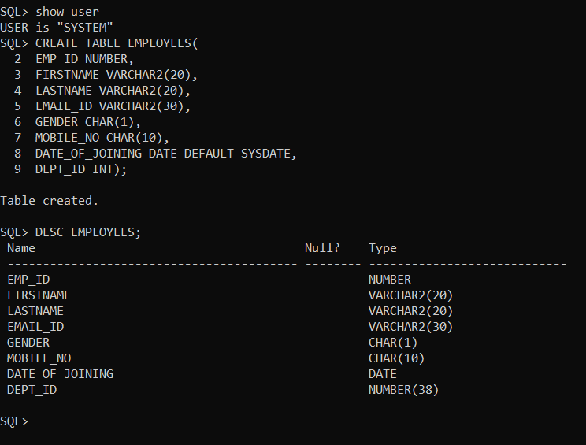

- **`ALTER`**

  1. ADDING COLUMN
  2. MODIFYING COLUMN
  3. DROPPING COLUMN
  4. RENAMING COLUMN

```bash
ALTER TABLE EMPLOYEES ADD DOB DATE;
```

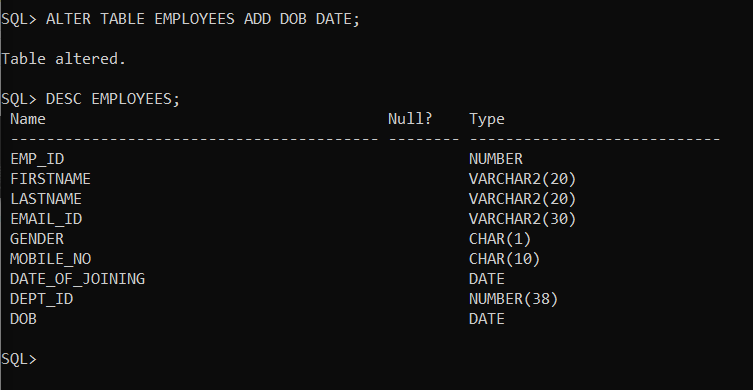

#### **ADDING MULTIPLE COLUMNS**

```bash
ALTER TABLE EMPLOYEES ADD(SALARY NUMBER(10,2),COL1 NUMBER);
```

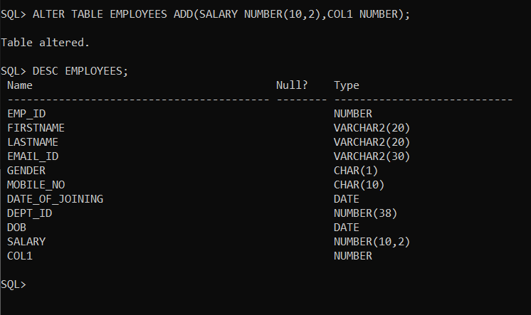

```bash
ALTER TABLE EMPLOYEES MODIFY COL1 VARCHAR2(10);
```

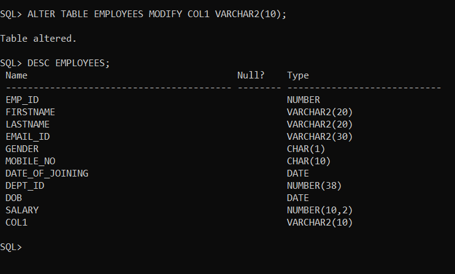

```bash
ALTER TABLE EMPLOYEES DROP COLUMN SALARY;
```

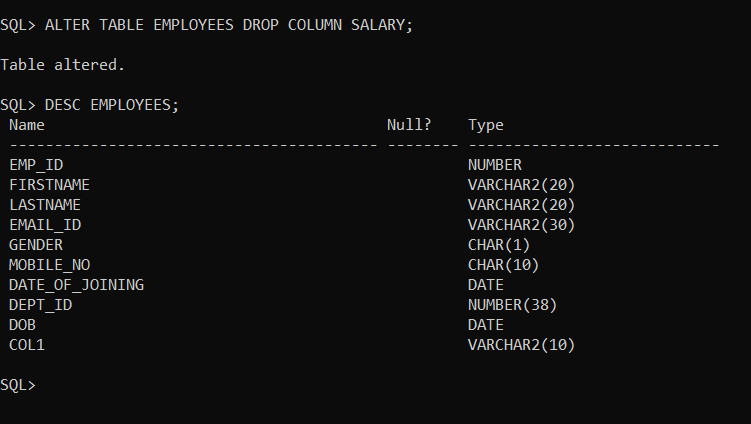

```bash
ALTER TABLE EMPLOYEES SET UNUSED COLUMN COL1;
```

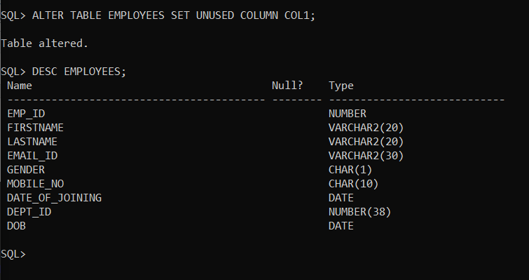

```bash
ALTER TABLE EMPLOYEES DROP UNUSED COLUMN;
```

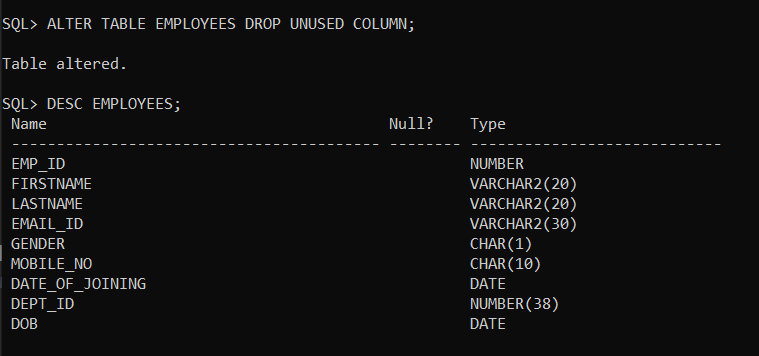

- **`DROP`**

```bash
DROP TABLE EMPLOYEES;
```

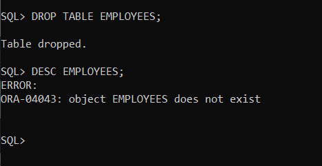

- **`TRUNCATE`**

```bash
TRUNCATE TABLE EMPLOYEES;
```

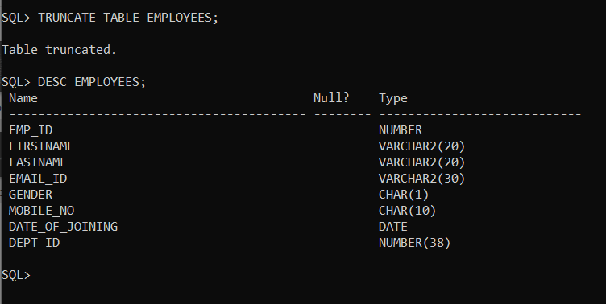

- **`RENAME`**

```bash
ALTER TABLE EMPLOYEES RENAME COLUMN MOBILE_NO TO PHONE_NO;
```

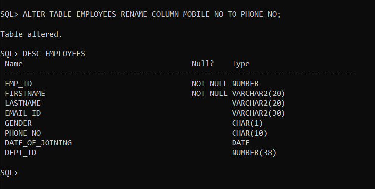

---

## Types of Constraints

- NOT NULL
- UNIQUE
- PRIMARY KEY
- CHECK
- FOREIGN KEY

### **`NOT NULL`**

```bash
CREATE TABLE SAMPLE1(
    COL1 NUMBER CONSTRAINT SAMPLE1_COL1_NN NOT NULL,
    COL2 NUMBER NOT NULL
);
```

```bash
ALTER TABLE EMPLOYEES MODIFY FIRSTNAME VARCHAR2(20) CONSTRAINT EMPLOYEES_FIRSTNAME_NN NOT NULL;
```


### **`UNIQUE`**

```bash
CREATE TABLE SAMPLE2(
    COL1 NUMBER CONSTRAINT SAMPLE2_COL1_UN UNIQUE,
    COL2 NUMBER,
    COL3 NUMBER,
    CONSTRAINT SAMPLE2_UNIQUE UNIQUE(COL2,COL3)
);
```

```bash
ALTER TABLE EMPLOYEES ADD CONSTRAINT EMPLOYEE_EMAIL_UN UNIQUE(EMAIL_ID);
ALTER TABLE EMPLOYEES ADD CONSTRAINT EMPLOYEE_MOBILE_UN UNIQUE(MOBILE_NO);
```

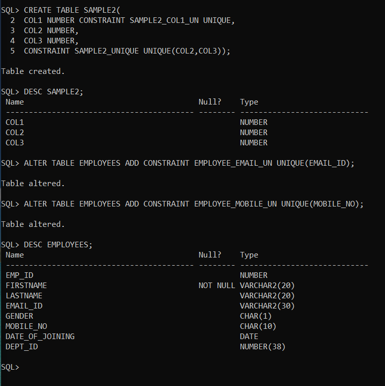

### **`PRIMARY KEY`**

```bash
CREATE TABLE SAMPLE3(
COL1 NUMBER CONSTRAINT SAMPLE3_PK PRIMARY KEY,
COL2 NUMBER
);
```

```bash
ALTER TABLE EMPLOYEES ADD CONSTRAINT EMPLOYEES_PK PRIMARY KEY(EMP_ID);
```

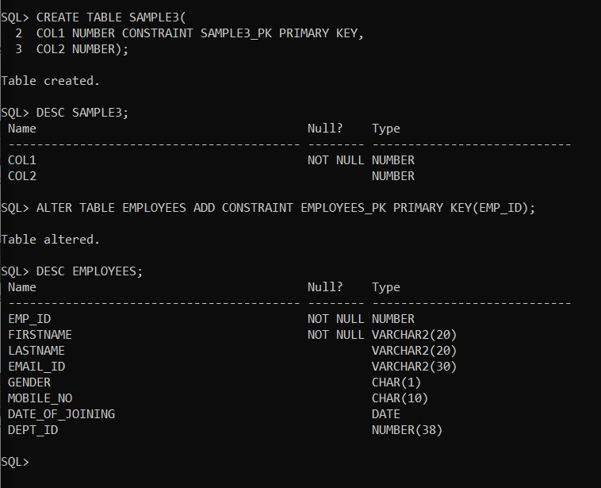

### **`CHECK`**

```bash
CREATE TABLE SAMPLE4(
    COL1 NUMBER(10) CONSTRAINT SAMPLE4_COL1_CHECK CHECK(COL1 >= 10000)
);
```

```bash
ALTER TABLE EMPLOYEES
ADD CONSTRAINT EMP_GENDER_CHECK(GENDER IN('M','F'));
```

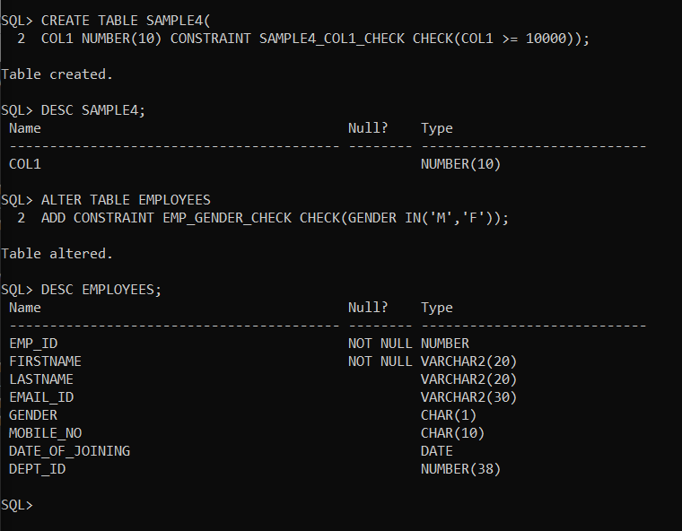

### **`FOREIGN KEY`**

```bash
ALTER TABLE EMPLOYEES
ADD CONSTRAINT EMP_DEPT_REL FOREIGN KEY(DEPT_ID)
REFERENCES DEPARTMENTS(DEPT_ID) ON DELETE SET NULL;
```

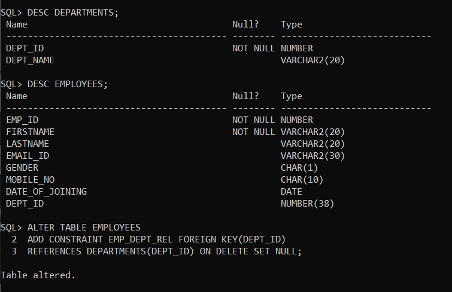
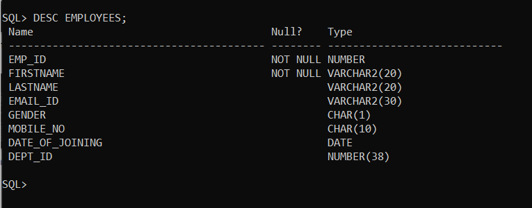

## Managing Constraints

- Viewing Constraint
- Adding Constraint
- Disabling Constraint
- Enabling Constraint
- Dropping Constraint

---

### **Data Manipulation Language (DML) Statements**
